# Calamity Details

<table><thead><tr><th width=267px>Calamity</th><th>Description</th><th width=138px>Remedy</th></tr></thead><tbody>

 <tr><td>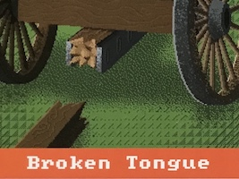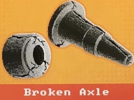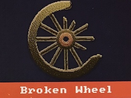</td>
  <td>When the calamity is played on you, immediately roll the die.  On a 4, 5, or 6 the calamity is discarded and does 
  not affect you.  On a 1, 2, or 3 you receive the calamity and cannot use the "Forge a New Trail" action until it is 
  mended.  If you don't mend the calamity on your next turn (however many actions you have) your entire wagon party dies and you are 
  out of the game.  The calamity can be mended by a spare parts supply or as the action of arriving in a town. </td>
  <td>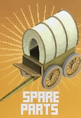</td></tr>

 <tr><td>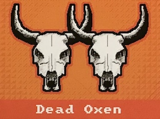</td>
  <td>You cannot use the "Forge a New Trail" action until it is mended.  If you don't mend the calamity on your next
  turn (however many actions you have) your entire wagon party dies and you are out of the game.  The calamity can be 
  mended by an oxen supply or as the action of arriving in a town.</td>
  <td></td></tr>

 <tr><td>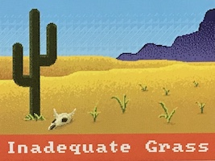</td>
  <td>Has no effect as long as the other Inadequate Grass card is not played on someone.  It can only be mended by the 
  "remove a calamity" action in a town.  If the other Inadequate Grass card comes up, both players, including the 
  one that just got the calamity now have dead oxen. The calamity now works exactly like the dead oxen calamity (see 
  above).  You cannot forge new trail and it can be mended with an oxen supply card. Note that the inadequate grass 
  calamity cannot be mended with an oxen supply card, but once it becomes a dead oxen problem, then it can be.</td>
  <td></td></tr>

 <tr><td>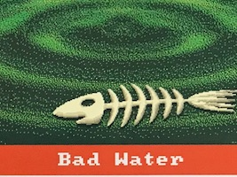</td>
  <td>Has no effect as long as the other Bad Water card is not played on someone.  It can be mended by a Clean Water 
  supply or as the action of arriving in a town.  If the other Bad Water card comes up, both players, 
  including the one that just got the calamity now have dead oxen. The calamity now works exactly like the dead oxen 
  calamity (see above).  You cannot forge new trail and it can be mended with an oxen supply card. Note that the bad 
  water calamity can be mended by clean water, but once it becomes a dead oxen problem then you need an oxen supply
  card, not a clean water supply card.</td>
  <td></td></tr>

 <tr><td></td>
  <td>On your first turn after receiving the Measles calamity, you have one fewer action to use unless you mend the calamity.
  Meaning, if you had 4 actions then you would have only 3 actions unless you used one of those actions to play a Medicine
  card and cure the Measles.  If you have only 1 action, then you have 0 actions for that turn and can take no action (you
  lose your turn), there is no option to avoid it because you have no other actions to use.  Other than the loss of an
  action on that first turn, the Measles has no effect on you until the other Measles card comes up.  If you have not
  mended the calamity by then, both you and the other player lose a wagon member (and therefore an action) permanently.
  In this case, the other player that just got the Measles does not have a temporarily reduced action count for their first
  turn on top of this. The wagon member with measles has simply died.  At this point the measles cards are discarded.
  You can mend Measles with a Medicine supply, whether on your first turn after receiving it or later.</td>
  <td>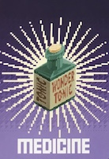</td></tr>

 <tr><td>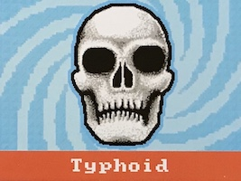</td>
  <td>If you do not cure the Typhoid on the first turn after receiving it, 
  you lose one of the people in your wagon. To mend it, you need 1 clean water supply and 1 medicine supply.
  After that turn, if you lose a wagon member, discard the calamity card.</td>
  <td>&nbsp;</td></tr>

 <tr><td>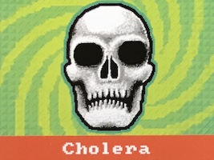</td>
  <td>Has no ill effect on you until the other Cholera card comes up. To mend it, use 2 medicine cards.  If the other 
  Cholera card is played on any player before you have mended this one, 
  then you lose a person from your wagon, and the other player that just received the second Cholera card (whether that 
  is you or another player) also loses a person from their wagon.  At this point the Cholera cards are discarded.</td>
  <td></td></tr>

 <tr><td></td>
  <td>You lose one virtual person from your wagon.  Nothing to do about it. Immediately deduct the wagon member and discard the card.</td>
  <td></td></tr>

 <tr><td>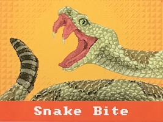</td>
  <td>You lose one virtual person from your wagon.  Nothing to do about it. Immediately deduct the wagon member and discard the card.</td>
  <td></td></tr>

 <tr><td>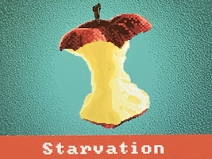</td>
  <td>You have two turns to mend it.  If 
  you do not, you lose one of the people in your wagon.  To mend it, you need a food supply.
  After the second turn, mark the wagon member dead and discard the calamity card.</td>
  <td>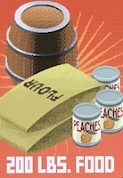</td></tr>

 <tr><td></td>
  <td>If you do not mend this calamity on your next turn after receiving it, 
  you lose one of the people in your wagon. To mend it, you need a clothing supply.
  After that turn, mark the wagon member dead and discard the calamity card.</td>
  <td>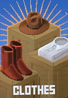</td></tr>

 <tr><td>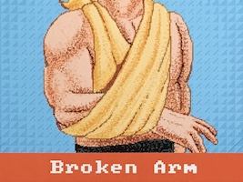</td>
  <td>For your next two turns you have one fewer actions than you have people in your wagon.  If you only had one
  person in your wagon this means you can't do anything on your next two turns. After those two turns, discard the
  calamity card.</td>
  <td></td></tr>

 <tr><td>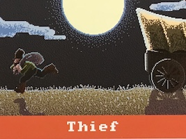</td>
  <td>The player you selected for the calamity must fan out their supply cards and allow you to draw one at random.  
  Except, if they have the bullets supply card, they can instead show that to you and discard it and then the roles get
  reversed and they get to steal a card from you. If you also have a bullets supply card, then you can show and discard
  it and flip the situation back around to stealing from them. This could continue except that there are only two
  bullets cards.  You can't trade a supply for bullets.  Discard the calamity card as soon as the theiving is resolved.</td>
  <td>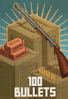</td></tr> 

 <tr><td>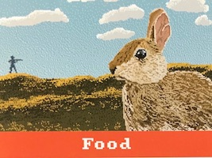</td>
  <td>If you have a bullets supply card you can discard it and collect a food supply card from the supply bank (assuming
  there is one). If you do not have bullets, or don't want to use them, then this calamity has no 
  effect. You can't trade a supply for bullets. Whether you take advantage or not, discard the calamity card.</td>
  <td></td></tr> 

</tbody></table>
